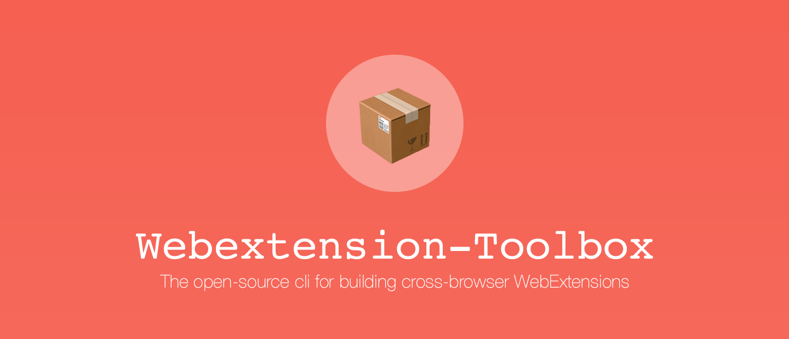

[](https://www.npmjs.com/package/webextension-toolbox)

[](https://www.npmjs.com/package/webextension-toolbox)
[](https://github.com/HaNdTriX/webextension-toolbox)
[](https://github.com/HaNdTriX/webextension-toolbox)
[](https://standardjs.com)

Small cli toolbox for creating cross-browser webextensions.
w
## Browser Support

* `chrome` (polyfill)
* `opera` (polyfill)
* `firefox`
* `edge`

## Features

* [react.js](https://reactjs.org/) support
* [babel](https://babeljs.io/) support
* packing
* auto extension reload
* manifest validation
* manifest defaults

## Usage

### Install

    $ npm install -g webextension-toolbox

### Development

#### Syntax

    $ webextension-toolbox dev <vendor> [..options]

#### Examples

    $ webextension-toolbox dev --help
    $ webextension-toolbox dev chrome
    $ webextension-toolbox dev firefox
    $ webextension-toolbox dev opera
    $ webextension-toolbox dev edge

### Build

#### Syntax

    $ webextension-toolbox build <vendor> [..options]


#### Examples

    $ webextension-toolbox build --help
    $ webextension-toolbox build chrome
    $ webextension-toolbox build firefox
    $ webextension-toolbox build opera
    $ webextension-toolbox build edge

### Node.js API

```js
const { compile } = require('webextension-toolbox')

const compiler = compile({
  vendor: 'chrome',
  src: 'app',
  target: 'build/[vendor]',
  packageTarget: 'packages',
  dev: false,
  devtool: false,
  autoReload: false,
  copyIgnore: [ '*.js', '*.json', '!_locales/**/*.json' ],
  pack: false
})

compiler.run((error, stats) => console.log(error, stats))

// or

compiler.watch({}, (error, stats) => console.log(error, stats))
```

### Browser API

Always use the [webextension browser api](https://developer.mozilla.org/de/Add-ons/WebExtensions). Webextension-Toolbox will polyfill it for you in chrome and opera.

### Entry points

All javascript files located at the root of your `./src` or `./src/scripts` directory will create a seperate bundle.

    "app/background.js"               -> "dist/<vendor>/dist/background.js"
    "app/scripts/background.js"       -> "dist/<vendor>/dist/scripts/background.js"
    "app/someDir/someFile.js"         -> Will be ignored.

## License

Copyright 2018 Henrik Wenz

This project is free software released under the MIT license
